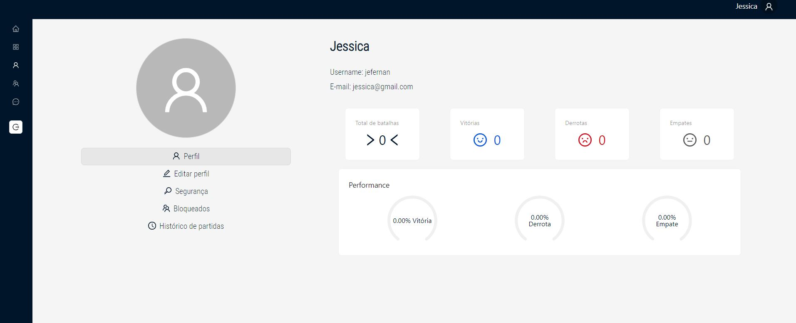
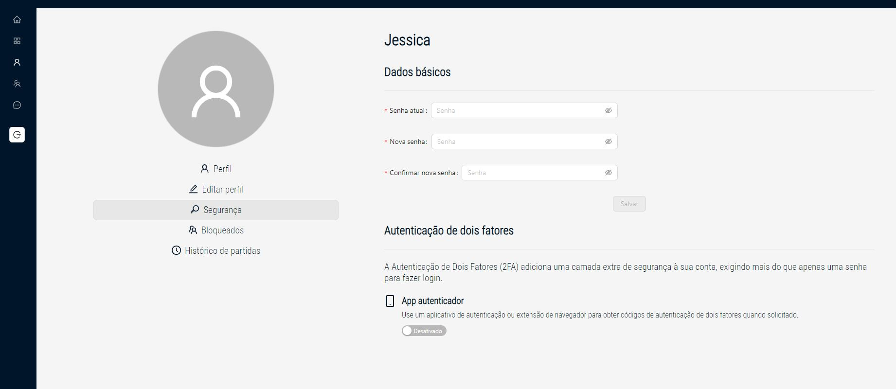
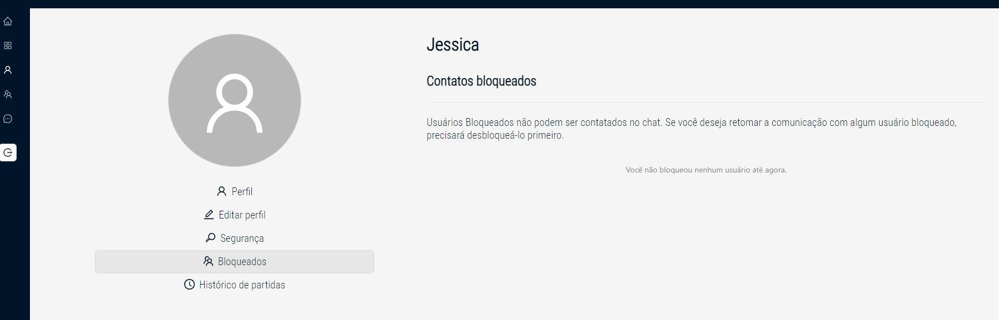
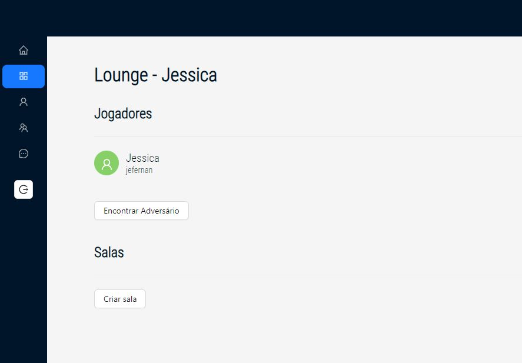
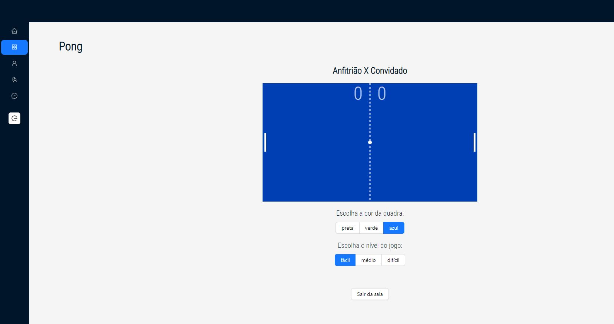
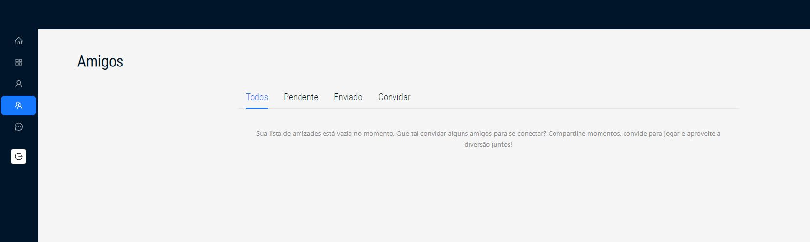
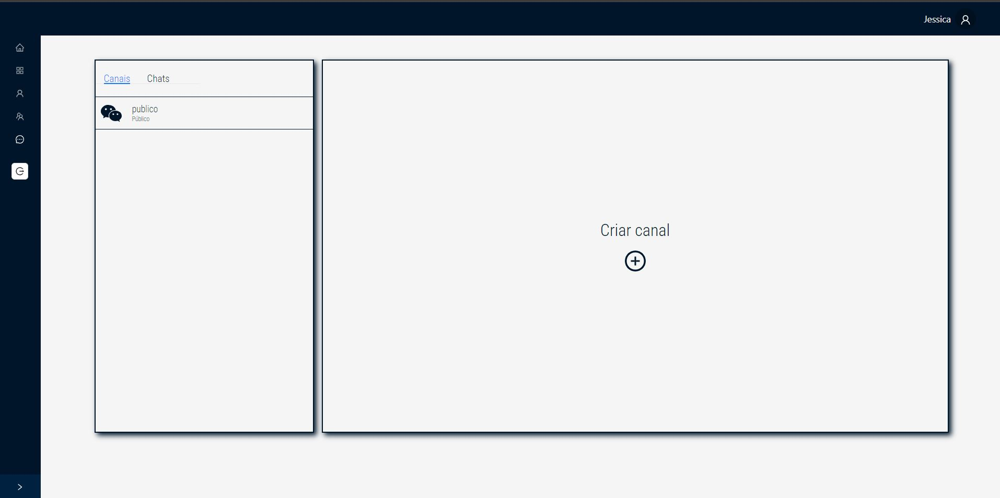
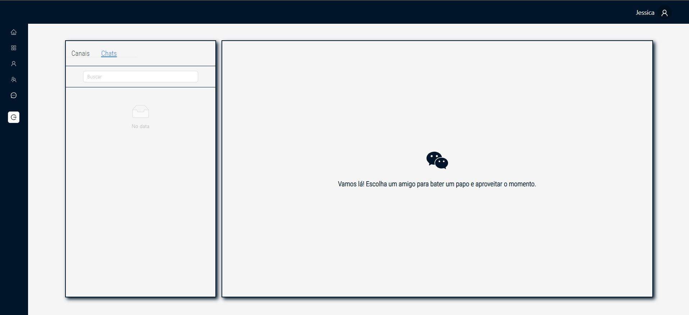

<h1 align="center">
	
 </h1>

 <div align="center">

[](https://github.com/nandajfa/ft_transcendence/blob/main/LICENSE)

 </div>

### 🗣️ About

> _This project is about creating a website for the mighty Pong contest!_

---

### Index

- [Introduction](#introduction)
- [Technologies](#technologies)
- [Layout](#layout)
- [References 📌](#references)
- [Usage](#usage)
- [Skills 📄](#skills)
- [Author Info ✒️](#author)

## Introduction

Implement a website where users can play Pong with each other. There are a user interface, a chat and the games will be multiplayer online and in real time.

## Technologies

- NestJS
- TypeScript
- React
- PostgreSQL
- Docker

## Layout

<h1 align="center">
	
  
  
  
  
  
  
  
  
  
 </h1>

## Usage

```bash
# Clone the project and acess the folder
git clone https://github.com/nandajfa/ft_transcendence && cd ft_transcendence

# Run make to build containers
make

# Access pages
http://localhost:3000/

# Clean the program
make fclean

```

## References

- [Nodejs - Docs](https://nodejs.org/en/docs)
- [Nestjs - Docs](https://docs.nestjs.com/)
- [NestJS in 100 Seconds](https://www.youtube.com/watch?v=0M8AYU_hPas)
- [Criando uma aplicação com NestJS e PrismaIO](https://www.youtube.com/watch?v=0Idug0e9tPw)
- [React - Docs](https://legacy.reactjs.org/docs/getting-started.html)
- [Building a NestJS Chat App with Websockets and MySQL](https://progressivecoder.com/building-a-nestjs-chat-app-with-websockets-and-mysql/)
- [jwt](https://jwt.io/introduction)
- [Google login in Nest](https://dev.to/imichaelowolabi/how-to-implement-login-with-google-in-nest-js-2aoa)
- [Google Authentication using NestJs](https://www.youtube.com/watch?v=q8tZQxT4YPU)
- [Auth in nestjs and angular](https://medium.com/@nielsmeima/auth-in-nest-js-and-angular-463525b6e071)
- [42 API](https://api.intra.42.fr/apidoc)

## Skills

- Web
- Group & interpersonal
- Rigor

## Author

<table >
  <tr>
    <td align="center"><a href="https://github.com/marcocslima"><br /><sub><b>Marco Lima</b></sub></a><br />
    <td align="center"><a href="https://github.com/Mitsu325"><br /><sub><b>Patrícia Mitsuko</b></sub></a><br />
        <td align="center"><a href="https://www.linkedin.com/in/jessica-fernanda-programadora"><br /><sub><b>Jessica Fernanda</b></sub></a><br />

  </tr>

<div align="right">
  <b><a href="#index">↥ back to top</a></b>
</div>
</br>
